# Design — Bootstrap

## 1. Visão Geral Técnica

A feature Bootstrap transforma a aplicação kmbr em um Progressive Web App (PWA) completo, implementado sobre Next.js 16 com App Router e gerenciado pelo Serwist (wrapper de Workbox). A abordagem central é o uso de um Service Worker que opera em três eixos: (1) cache estratégico de assets estáticos com política cache-first para imutáveis e network-first para dinâmicos; (2) detecção e download em background de novas versões com ativação controlada pelo usuário via banner; e (3) interceptação de navegação offline para servir assets do cache local. A lógica de controle do PWA (decisão de exibir banners, gerenciar estado da sessão de descarte) reside no Domain via casos de uso; componentes React atuam como adapters de apresentação que consomem esses casos de uso via hooks. Nenhum módulo Next.js, Serwist ou Web API de navegador é importado diretamente em entidades Domain.

---

## 2. Arquitetura de Componentes

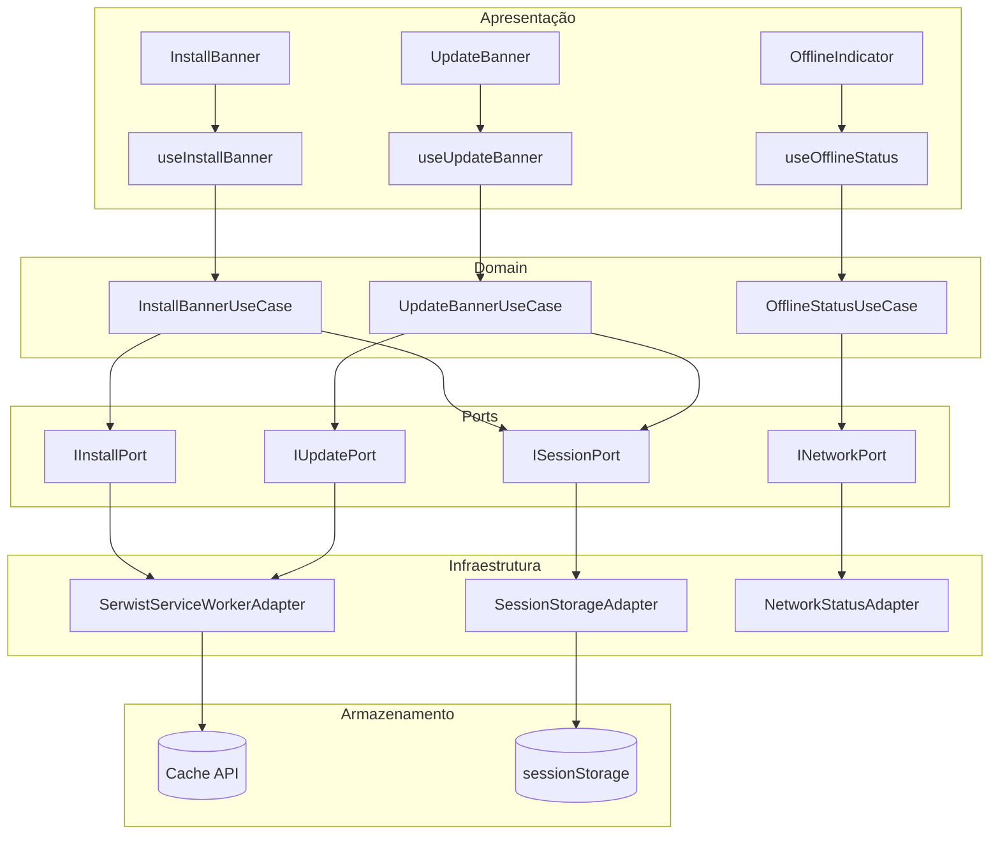

### InstallBannerUseCase

**Camada:** Domain
**Responsabilidade:** Decidir se o banner de instalação deve ser exibido (suporte PWA detectado, app não instalado, banner não descartado na sessão atual). Gerenciar ações de instalar e descartar. (REQ-1, REQ-2, REQ-3, REQ-5, REQ-6, REQ-22)
**Dependências:** IInstallPort, ISessionPort

### UpdateBannerUseCase

**Camada:** Domain
**Responsabilidade:** Decidir se o banner de atualização deve ser exibido (Service Worker com versão nova em estado `waiting`, banner não adiado na sessão atual). Gerenciar ações de atualizar agora e adiar. (REQ-7, REQ-8, REQ-9, REQ-11, REQ-12, REQ-13, REQ-14, REQ-15, REQ-16)
**Dependências:** IUpdatePort, ISessionPort

### OfflineStatusUseCase

**Camada:** Domain
**Responsabilidade:** Reagir a mudanças de conectividade e expor estado booleano de conexão para o sistema. (REQ-17, REQ-18, REQ-19)
**Dependências:** INetworkPort

### SerwistServiceWorkerAdapter _(novo)_

**Camada:** Adapter de Infraestrutura
**Responsabilidade:** Registrar e configurar o Service Worker via Serwist; interceptar evento `beforeinstallprompt`; detectar SW em estado `waiting` para nova versão; emitir mensagem `skipWaiting`; gerenciar cache de assets (cache-first para imutáveis, network-first para dinâmicos) com limite de 50 MB e evicção automática. Implementa IInstallPort e IUpdatePort. (REQ-3, REQ-4, REQ-13, REQ-14, REQ-20, REQ-21, NFR-1, NFR-4)
**Dependências:** Serwist, Cache API, CacheStorage

### SessionStorageAdapter _(novo)_

**Camada:** Adapter de Infraestrutura
**Responsabilidade:** Persistir na `sessionStorage` os flags de descarte de banner na sessão atual (`installBannerDismissed`, `updateBannerDismissed`). Implementa ISessionPort. (REQ-5, REQ-6, REQ-11)
**Dependências:** Web API sessionStorage

### NetworkStatusAdapter _(novo)_

**Camada:** Adapter de Infraestrutura
**Responsabilidade:** Escutar eventos `online`/`offline` do navegador e notificar o Domain via callback. Implementa INetworkPort. (REQ-18, REQ-19)
**Dependências:** Web API `navigator.onLine`, `window` events

### InstallBanner _(novo)_

**Camada:** Adapter de Apresentação (React)
**Responsabilidade:** Renderizar o banner de instalação com botões "Instalar" e "Descartar". Consumir `useInstallBanner`. (REQ-1, REQ-2)
**Dependências:** useInstallBanner

### UpdateBanner _(novo)_

**Camada:** Adapter de Apresentação (React)
**Responsabilidade:** Renderizar o banner de atualização com botões "Atualizar agora" e "Depois". Consumir `useUpdateBanner`. (REQ-7)
**Dependências:** useUpdateBanner

### OfflineIndicator _(novo)_

**Camada:** Adapter de Apresentação (React)
**Responsabilidade:** Renderizar o indicador visual "Offline" na barra de navegação ou header. Consumir `useOfflineStatus`. (REQ-18, REQ-19)
**Dependências:** useOfflineStatus

### useInstallBanner / useUpdateBanner / useOfflineStatus _(novos)_

**Camada:** Adapter de Apresentação (React hooks)
**Responsabilidade:** Fazer a ponte entre casos de uso do Domain e componentes React. Instanciam adapters de infraestrutura e casos de uso; expõem estado e callbacks tipados para os componentes. (NFR-2, NFR-5)
**Dependências:** Casos de uso do Domain, adapters de infraestrutura

---

## 3. Modelo de Dados

Esta feature não persiste dados em banco de dados. Todas as entidades são runtime — mantidas em memória ou em `sessionStorage` (escopo de sessão de aba). Não há migrações ou DDL.

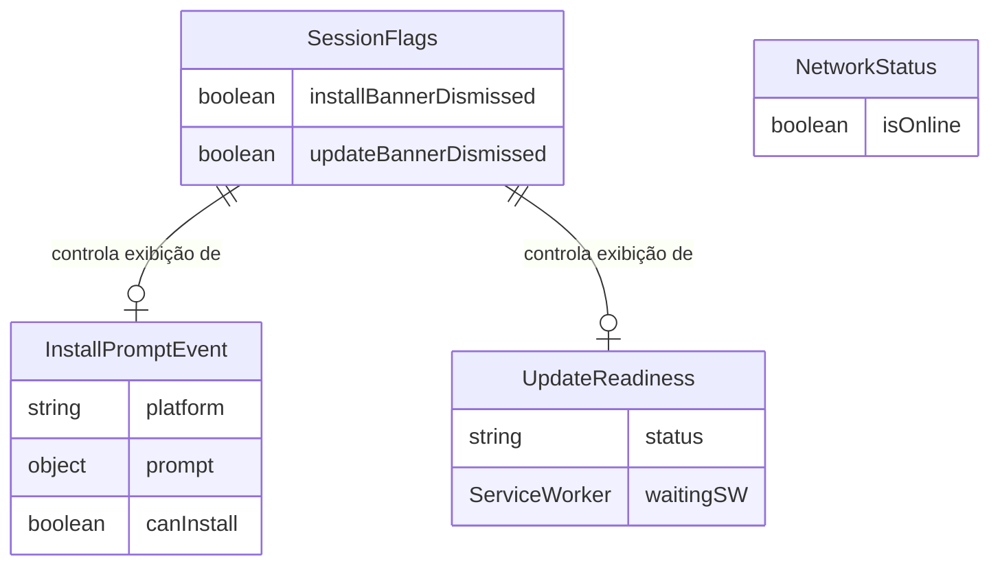

### SessionFlags

Persiste em `sessionStorage`. Expira automaticamente ao fechar a aba (sem persistência entre sessões — REQ-6, REQ-11).

| Campo                    | Tipo      | Descrição                                                                   |
| ------------------------ | --------- | --------------------------------------------------------------------------- |
| `installBannerDismissed` | `boolean` | `true` se o usuário clicou "Descartar" no banner de instalação nesta sessão |
| `updateBannerDismissed`  | `boolean` | `true` se o usuário clicou "Depois" no banner de atualização nesta sessão   |

### InstallPromptEvent

Mantido em memória pelo `SerwistServiceWorkerAdapter`. Capturado do evento `beforeinstallprompt` do navegador (REQ-1, REQ-3).

| Campo        | Tipo                       | Descrição                                                           |
| ------------ | -------------------------- | ------------------------------------------------------------------- |
| `platform`   | `string`                   | Plataforma reportada pelo navegador (ex: `"web"`, `"android"`)      |
| `prompt`     | `BeforeInstallPromptEvent` | Referência ao evento nativo do navegador para disparar o prompt     |
| `canInstall` | `boolean`                  | `true` se o evento foi capturado e o prompt ainda não foi disparado |

### UpdateReadiness

Mantido em memória pelo `SerwistServiceWorkerAdapter`. Representa o estado do Service Worker em relação a uma nova versão disponível (REQ-7, REQ-13, REQ-14).

| Campo       | Tipo                                    | Descrição                                                                            |
| ----------- | --------------------------------------- | ------------------------------------------------------------------------------------ |
| `status`    | `'idle' \| 'available' \| 'activating'` | Estado da atualização: sem nova versão, versão aguardando, ativando após confirmação |
| `waitingSW` | `ServiceWorker \| null`                 | Referência ao SW em estado `waiting` pronto para ativar                              |

### NetworkStatus

Mantido em memória pelo `NetworkStatusAdapter`. Atualizado em tempo real via eventos do navegador (REQ-18, REQ-19).

| Campo      | Tipo      | Descrição                                                 |
| ---------- | --------- | --------------------------------------------------------- |
| `isOnline` | `boolean` | `true` se `navigator.onLine` e último evento foi `online` |

---

## 4. API / Contratos

Esta feature não expõe endpoints HTTP. Os contratos são de três tipos: mensagens do Service Worker para o cliente, o Web App Manifest e as interfaces TypeScript das Ports.

### Mensagem: SKIP_WAITING

**Direção:** Cliente → Service Worker (via `postMessage`)
**Autenticação:** nenhuma (mesmo origem)
**Disparada por:** `UpdateBannerUseCase` quando usuário clica "Atualizar agora" (REQ-9)

```
{ type: 'SKIP_WAITING' }
```

Resposta esperada: Service Worker em `waiting` chama `self.skipWaiting()` e assume controle. O cliente escuta o evento `controllerchange` e executa `window.location.reload()`.

### Mensagem: SW_UPDATED (notificação)

**Direção:** Service Worker → Cliente (via `postMessage` broadcast)
**Disparada por:** `SerwistServiceWorkerAdapter` quando detecta SW em estado `waiting` (REQ-7)

```
{ type: 'SW_UPDATED' }
```

### Web App Manifest — `public/manifest.json`

**Contrato:** instalação PWA com o navegador (REQ-4, REQ-22)

| Campo              | Valor                                                  |
| ------------------ | ------------------------------------------------------ |
| `name`             | `"Kmbr"`                                               |
| `short_name`       | `"Kmbr"`                                               |
| `display`          | `"standalone"`                                         |
| `start_url`        | `"/"`                                                  |
| `theme_color`      | a definir conforme design system                       |
| `background_color` | a definir conforme design system                       |
| `icons`            | array de ícones em múltiplas resoluções (192px, 512px) |

### Port: IInstallPort

Interface outbound do Domain para interação com o evento de instalação PWA (REQ-1, REQ-3, REQ-22).

| Método                           | Retorno         | Descrição                                                |
| -------------------------------- | --------------- | -------------------------------------------------------- |
| `isInstallAvailable(): boolean`  | `boolean`       | Verifica se o evento `beforeinstallprompt` foi capturado |
| `promptInstall(): Promise<void>` | `Promise<void>` | Dispara o prompt nativo de instalação                    |

### Port: IUpdatePort

Interface outbound do Domain para gerenciar ciclo de vida de atualização via SW (REQ-7, REQ-9, REQ-13, REQ-15, REQ-16).

| Método                                          | Retorno           | Descrição                                               |
| ----------------------------------------------- | ----------------- | ------------------------------------------------------- |
| `getUpdateReadiness(): UpdateReadiness`         | `UpdateReadiness` | Retorna estado atual da atualização                     |
| `onUpdateAvailable(callback: () => void): void` | `void`            | Registra callback acionado quando SW entra em `waiting` |
| `activateUpdate(): Promise<void>`               | `Promise<void>`   | Envia `SKIP_WAITING` e recarrega o app                  |

### Port: ISessionPort

Interface outbound do Domain para persistência de flags de sessão (REQ-5, REQ-6, REQ-11, REQ-12).

| Método                                       | Retorno   | Descrição                     |
| -------------------------------------------- | --------- | ----------------------------- |
| `getFlag(key: string): boolean`              | `boolean` | Lê flag da sessão atual       |
| `setFlag(key: string, value: boolean): void` | `void`    | Persiste flag na sessão atual |

### Port: INetworkPort

Interface outbound do Domain para estado de conectividade (REQ-17, REQ-18, REQ-19).

| Método                                                      | Retorno   | Descrição                                        |
| ----------------------------------------------------------- | --------- | ------------------------------------------------ |
| `isOnline(): boolean`                                       | `boolean` | Retorna estado atual de conectividade            |
| `onStatusChange(callback: (online: boolean) => void): void` | `void`    | Registra callback para mudanças de conectividade |

---

## 5. Fluxo de Execução

### Fluxo: Usuário instala o app como PWA via banner

1. **Navegador** dispara evento `beforeinstallprompt` — `SerwistServiceWorkerAdapter` captura e armazena em `InstallPromptEvent.prompt`.
2. **useInstallBanner** invoca `InstallBannerUseCase.shouldShowBanner()`: verifica `IInstallPort.isInstallAvailable()` = `true` e `ISessionPort.getFlag('installBannerDismissed')` = `false`.
3. **useInstallBanner** expõe `showBanner = true` para `InstallBanner`.
4. **InstallBanner** renderiza banner com botões "Instalar" e "Descartar".
5. Usuário clica "Instalar" — **InstallBanner** chama callback `onInstall`.
6. **useInstallBanner** delega para `InstallBannerUseCase.install()`, que chama `IInstallPort.promptInstall()`.
7. **SerwistServiceWorkerAdapter** executa `event.prompt()` — navegador exibe prompt nativo.
8. Usuário confirma no prompt nativo — navegador instala o app em modo standalone (REQ-3, REQ-4).

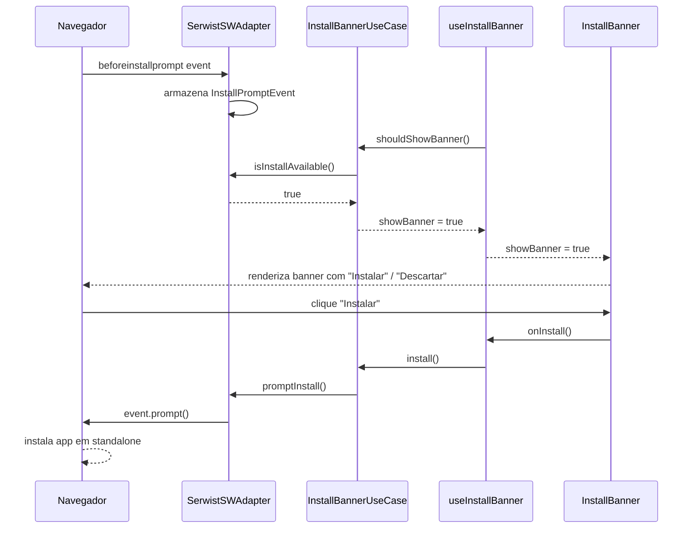

---

### Fluxo: Usuário descarta banner de instalação

1. Banner de instalação está visível (fluxo anterior, passos 1–4).
2. Usuário clica "Descartar" — **InstallBanner** chama callback `onDismiss`.
3. **useInstallBanner** delega para `InstallBannerUseCase.dismiss()`.
4. **InstallBannerUseCase** chama `ISessionPort.setFlag('installBannerDismissed', true)`.
5. **SessionStorageAdapter** persiste flag em `sessionStorage`.
6. **useInstallBanner** atualiza estado local `showBanner = false`.
7. **InstallBanner** deixa de ser renderizado (REQ-5, REQ-6).

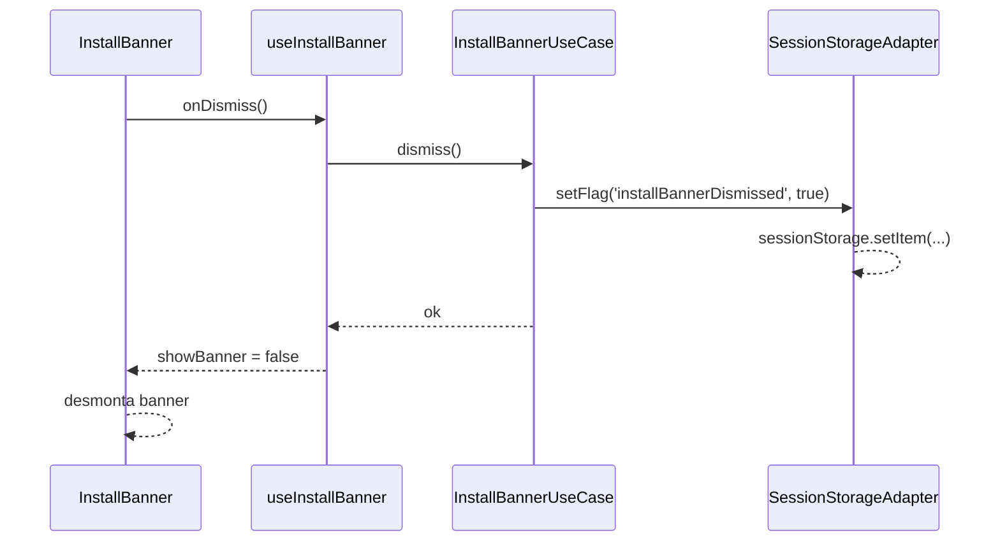

---

### Fluxo: App detecta nova versão e exibe banner de atualização

1. Usuário inicia nova sessão — `SerwistServiceWorkerAdapter` registra o SW via Serwist.
2. **SerwistServiceWorkerAdapter** recebe evento `waiting` do SW — atualiza `UpdateReadiness.status = 'available'` e notifica callbacks registrados.
3. **UpdateBannerUseCase** (via callback registrado em `IUpdatePort.onUpdateAvailable`) verifica `ISessionPort.getFlag('updateBannerDismissed')` = `false`.
4. **useUpdateBanner** expõe `showBanner = true`.
5. **UpdateBanner** renderiza banner com botões "Atualizar agora" e "Depois".
6. Versão anterior continua funcional enquanto banner é exibido (REQ-7, REQ-8).

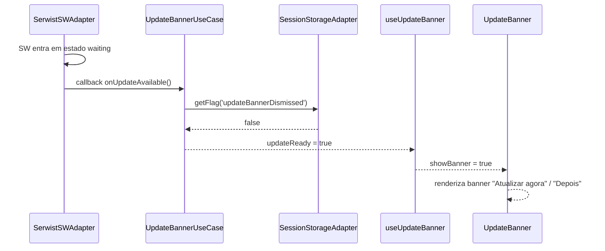

---

### Fluxo: Usuário clica "Atualizar agora" e app recarrega

1. **UpdateBanner** exibe banner (fluxo anterior).
2. Usuário clica "Atualizar agora" — **UpdateBanner** chama callback `onUpdate`.
3. **useUpdateBanner** delega para `UpdateBannerUseCase.activateUpdate()`.
4. **UpdateBannerUseCase** chama `IUpdatePort.activateUpdate()`.
5. **SerwistServiceWorkerAdapter** envia `postMessage({ type: 'SKIP_WAITING' })` para o SW em `waiting`.
6. SW chama `self.skipWaiting()` e assume controle — dispara evento `controllerchange`.
7. **SerwistServiceWorkerAdapter** escuta `controllerchange` e executa `window.location.reload()`.
8. App recarrega com a nova versão; sessão autenticada é preservada via cookie/token existente (REQ-9, REQ-10).

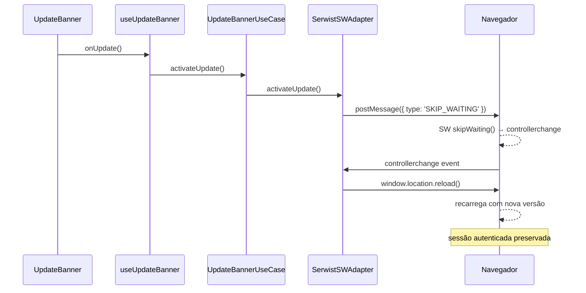

---

### Fluxo: Usuário clica "Depois" na atualização

1. **UpdateBanner** exibe banner.
2. Usuário clica "Depois" — **UpdateBanner** chama callback `onDefer`.
3. **useUpdateBanner** delega para `UpdateBannerUseCase.defer()`.
4. **UpdateBannerUseCase** chama `ISessionPort.setFlag('updateBannerDismissed', true)`.
5. **SessionStorageAdapter** persiste flag em `sessionStorage`.
6. **useUpdateBanner** atualiza `showBanner = false`.
7. App continua com versão anterior; SW em `waiting` permanece aguardando (REQ-11).

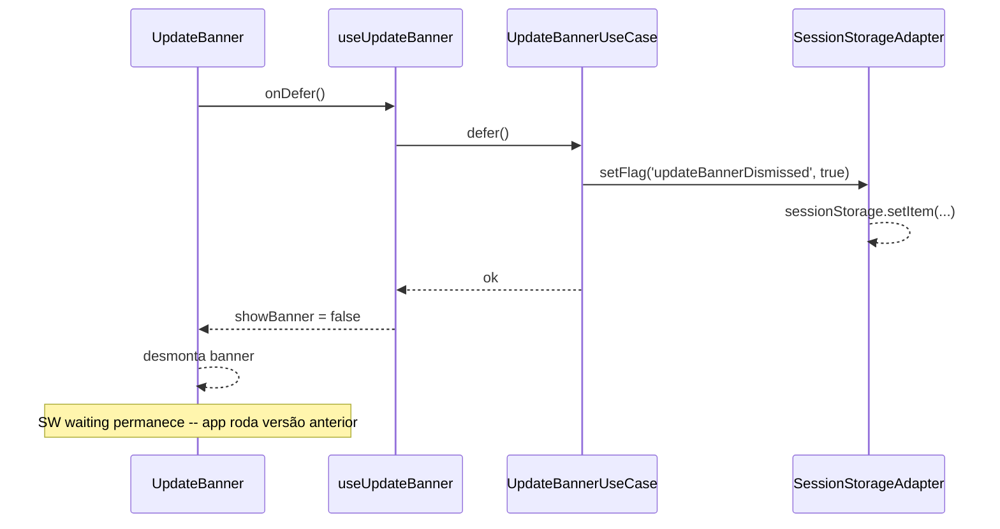

---

### Fluxo: Banner de atualização reaparece na próxima sessão

1. Usuário abre nova sessão (nova aba ou reinício do app).
2. `sessionStorage` é limpo — `updateBannerDismissed` = `false` (comportamento nativo de `sessionStorage`).
3. **SerwistServiceWorkerAdapter** detecta que SW continua em `waiting` (versão atualizada ainda não ativada).
4. **UpdateBannerUseCase** recebe callback `onUpdateAvailable`, verifica flag = `false`.
5. **useUpdateBanner** expõe `showBanner = true` novamente (REQ-12).

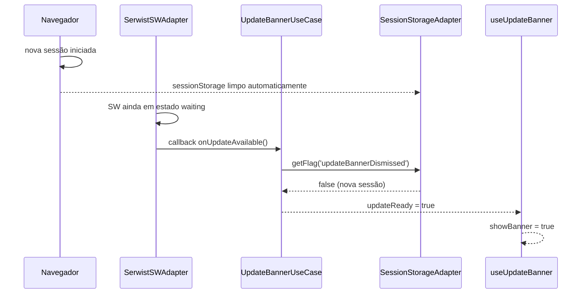

---

### Fluxo: App funciona offline com assets em cache

1. Usuário navega pela aplicação sem conexão de rede.
2. **NetworkStatusAdapter** detecta `navigator.onLine = false` e dispara callback.
3. **OfflineStatusUseCase** atualiza `NetworkStatus.isOnline = false`.
4. **useOfflineStatus** expõe `isOnline = false` para `OfflineIndicator`.
5. **OfflineIndicator** renderiza badge "Offline" na barra de navegação.
6. Navegador solicita assets — **SW** intercepta requisições e serve do `Cache API` (estratégia cache-first para assets estáticos).
7. Interface continua carregando e respondendo (REQ-17, NFR-3).
8. Quando conexão é restaurada, `NetworkStatusAdapter` dispara evento `online` → `OfflineIndicator` é removido (REQ-19).

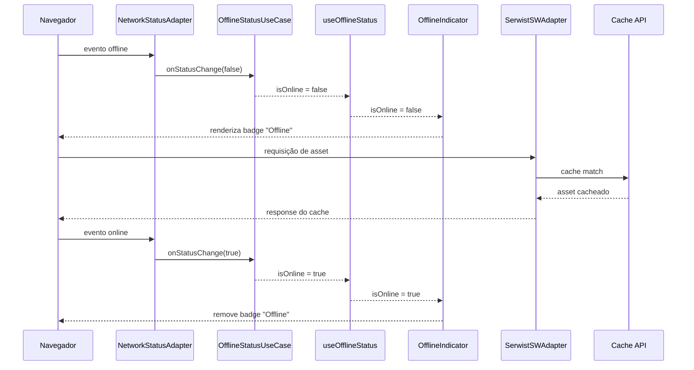

---

### Fluxo: App exibe indicador visual de modo offline

(Coberto pelo fluxo "App funciona offline com assets em cache" — passos 2–5 e 8.)

---

### Fluxo: App inicializa rapidamente via cache estratégico

1. Usuário clica no ícone do app instalado.
2. **Navegador** carrega o document — SW intercepta e serve HTML do cache imediatamente (estratégia cache-first).
3. Assets estáticos (CSS, JS, fontes, ícones) são servidos do `Cache API` sem round-trip de rede.
4. App fica totalmente interativo em menos de 3 segundos em 4G (NFR-1).
5. Em paralelo, **SerwistServiceWorkerAdapter** verifica se há nova versão disponível na rede (REQ-13).
6. Se nova versão detectada: download em background sem bloquear UI (REQ-14, NFR-2).
7. Verificação periódica a cada 60 minutos durante uso (REQ-13).

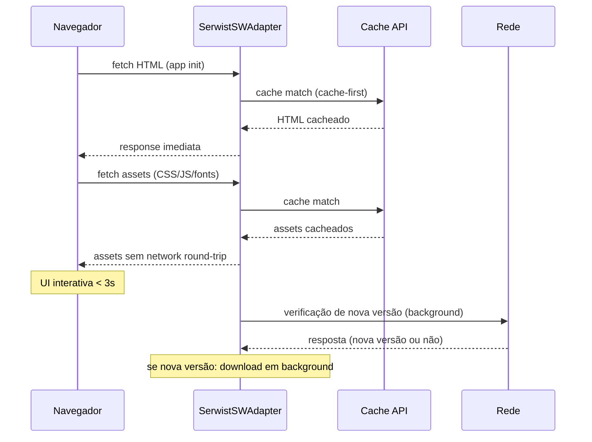

---

### Fluxo: Navegador sem suporte PWA funciona como web app tradicional

1. Usuário acessa a aplicação em navegador sem suporte a `ServiceWorker` ou `beforeinstallprompt`.
2. **SerwistServiceWorkerAdapter** detecta ausência de suporte (`'serviceWorker' in navigator` = `false`) — não registra SW, não intercepta `beforeinstallprompt`.
3. **InstallBannerUseCase.shouldShowBanner()** retorna `false` (`IInstallPort.isInstallAvailable()` = `false`).
4. **InstallBanner** não é renderizado.
5. Nenhum erro técnico ou console warning relacionado a PWA é emitido (REQ-22, NFR-5).
6. App funciona como web app tradicional com toda funcionalidade disponível.

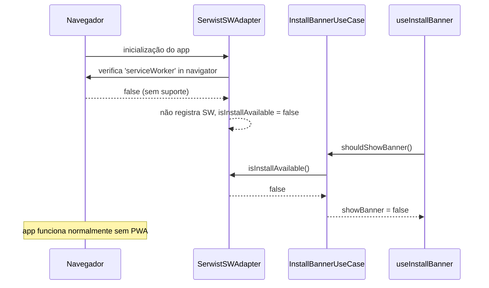

---

## 6. Decisões Técnicas

### DT-1: Serwist como abstração do Service Worker

**Problema:** Implementar um Service Worker completo (cache estratégico, background sync, interceptação de fetch) manualmente exige centenas de linhas de código com tratamento de edge cases complexos.
**Alternativas:**

- A: Implementação manual do SW com Cache API e Fetch API nativas.
- B: Serwist (wrapper sobre Workbox já declarado na stack do projeto).
  **Decisão:** B — Serwist.
  **Justificativa:** Serwist já é uma dependência declarada em `docs/stack.md` e integra nativamente com Next.js App Router. Reduz superfície de bugs em cache invalidation e background sync. Trade-off: dependência adicional, porém já aceita pela stack do projeto.
  **Requisito relacionado:** REQ-13, REQ-14, REQ-20, REQ-21, NFR-1, NFR-4.

---

### DT-2: sessionStorage para flags de descarte de banner

**Problema:** Flags de descarte dos banners (instalação e atualização) precisam de escopo claro — não devem persistir indefinidamente nem entre sessões.
**Alternativas:**

- A: `localStorage` — persiste entre sessões; banner de instalação nunca reapareceria após descarte em qualquer sessão futura.
- B: `sessionStorage` — escopo de aba/sessão; expira automaticamente ao fechar a aba.
- C: Estado React em memória — perdido ao recarregar a página.
  **Decisão:** B — `sessionStorage`.
  **Justificativa:** REQ-6 exige que o banner não reapareça na mesma sessão; REQ-12 exige que o banner de atualização reapareça na próxima sessão. `sessionStorage` satisfaz ambos sem lógica extra de expiração. Trade-off: comportamento diferente entre abas do mesmo navegador (cada aba tem sua própria `sessionStorage`), aceitável para este caso de uso.
  **Requisito relacionado:** REQ-5, REQ-6, REQ-11, REQ-12.

---

### DT-3: Limite de cache com evicção automática (50 MB, FIFO)

**Problema:** Sem limite, o cache de assets pode crescer indefinidamente, afetando o storage do dispositivo do usuário.
**Alternativas:**

- A: Sem limite — risco de storage overflow em dispositivos com pouco espaço.
- B: Limite de 50 MB com evicção FIFO via Serwist `ExpirationPlugin`.
- C: Limite configurável por tipo de asset (ex: 20 MB para JS, 10 MB para imagens).
  **Decisão:** B — 50 MB com FIFO via `ExpirationPlugin` do Serwist.
  **Justificativa:** NFR-4 define explicitamente o limite de 50 MB e estratégia FIFO. Serwist fornece `ExpirationPlugin` que implementa isso nativamente. Opção C adicionaria complexidade sem benefício claro para o perfil de assets desta aplicação. Trade-off: FIFO pode eventualmente remover assets mais frequentes que os mais antigos, mas para assets versionados isso é aceitável pois serão baixados novamente.
  **Requisito relacionado:** NFR-4.

---

### DT-4: Ativação de nova versão via skipWaiting + reload imediato

**Problema:** Quando o usuário confirma a atualização, há duas estratégias possíveis para ativar o novo SW.
**Alternativas:**

- A: `skipWaiting()` + `window.location.reload()` imediato — ativa o novo SW e recarrega a página no mesmo momento.
- B: Aguardar próxima navegação natural — o SW assume controle apenas na próxima vez que o usuário navegar para uma nova página, sem reload forçado.
  **Decisão:** A — `skipWaiting()` + reload imediato somente quando o usuário clicar "Atualizar agora".
  **Justificativa:** REQ-9 exige que o app carregue a nova versão imediatamente ao clicar "Atualizar agora". REQ-15 proíbe reload forçado durante sessão ativa sem confirmação. A combinação satisfaz ambos: reload ocorre apenas com confirmação explícita do usuário. Sessão autenticada preservada via cookie HTTP-only existente (REQ-10). Trade-off: reload causa perda de estado UI não persistido, aceitável pois o usuário fez escolha explícita.
  **Requisito relacionado:** REQ-9, REQ-10, REQ-15.

---

### DT-5: Domain sem dependência de Web APIs de navegador

**Problema:** Casos de uso de PWA (InstallBannerUseCase, UpdateBannerUseCase) precisam interagir com APIs de navegador (`BeforeInstallPromptEvent`, `ServiceWorker`, `sessionStorage`). Importar essas APIs diretamente no Domain violaria a constitution.
**Alternativas:**

- A: Importar Web APIs diretamente nos casos de uso — simples, mas viola a regra "Nunca importar tipos de Next.js, React, Drizzle ou next-auth dentro de entidades Domain".
- B: Abstrair via Ports (IInstallPort, IUpdatePort, ISessionPort, INetworkPort) — Domain depende apenas de interfaces; adapters de infraestrutura implementam o acesso real às Web APIs.
  **Decisão:** B — abstração via Ports.
  **Justificativa:** Constitution.md define explicitamente que o Domain deve depender apenas de tipos próprios e das Ports. Ports permitem testar os casos de uso com mocks sem precisar de um ambiente de navegador. Trade-off: mais arquivos de interface, custo amortizado pela testabilidade e conformidade arquitetural.
  **Requisito relacionado:** REQ-1, REQ-7, REQ-17 (todos os casos de uso de PWA); constitution.md.
