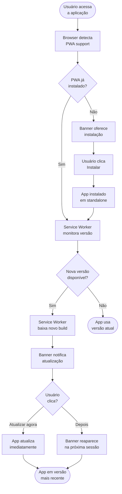
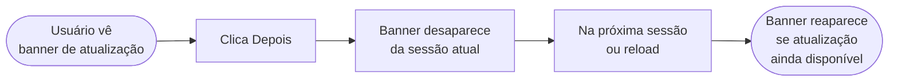
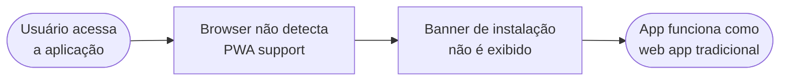
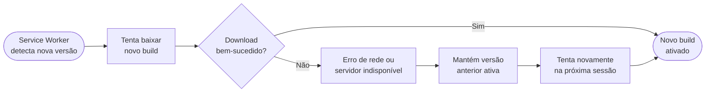

# PRD — Bootstrap

## Visão Geral

Permitir que a aplicação funcione como PWA (Progressive Web App) com suporte a instalação como app nativo e atualização automática de conteúdo sem intervenção do usuário. Quando novas versões estão disponíveis, o sistema atualiza o app automaticamente em segundo plano, garantindo que o usuário sempre tenha a versão mais recente.

---

## Problema

Hoje, a aplicação kmbr é uma web app tradicional. Quando o usuário tenta acessá-la via navegador mobile, não tem como instalá-la como app nativo e não recebe atualizações automáticas de versão. Se uma nova versão está disponível, o usuário precisa fazer refresh manual ou limpar o cache. Isso resulta em versões desalinhadas entre usuários, bugs não corrigidos ao longo do tempo, e experiência degradada quando offline ou com conexão lenta.

---

## Usuário-Alvo

Motoristas e taxistas acessando o app via navegador mobile (Android e iOS). Todos os usuários sem pré-requisitos especiais.

---

## Objetivos

1. Permitir que o usuário instale o app como PWA no seu dispositivo.
2. Implementar atualização automática de versão em background sem intervenção do usuário.
3. Exibir notificação de atualização disponível com opção "Atualizar agora" ou "Depois".
4. Garantir funcionamento offline de pelo menos 95% das funcionalidades principais.
5. Implementar cache estratégico de assets estáticos para reduzir tempo de inicialização.

---

## Critérios de Sucesso

| Critério                                             | Medida                                          |
| ---------------------------------------------------- | ----------------------------------------------- |
| App é instalável como PWA                            | Disponível em standalone mode em Android/iOS    |
| Atualização automática funciona em background        | Versão mais recente carregada na próxima sessão |
| Banner de atualização é exibido quando há novo build | "Atualizar agora" ou "Depois" disponíveis       |
| App funciona offline                                 | 95%+ das funcionalidades críticas sem rede      |
| Cache de assets reduz tempo de inicialização         | < 3 segundos para inicialização completa        |

---

## Fora do Escopo

- Sincronização de dados entre dispositivos
- Persistência local de dados de negócio (ex: histórico de corridas)
- Plugins ou extensões do navegador
- Telemetria de uso ou analytics avançado
- Suporte a navegadores legados (IE 11, Android 4)
- Push notifications nativas

---

## Fluxo Principal

---

## Fluxos Alternativos

### FA1: Usuário clica "Depois"

---

### FA2: Navegador sem suporte PWA

---

### FA3: Erro ao baixar atualização

---

## Dependências

- **Serwist**: biblioteca de Service Worker para gerenciar cache e background updates (já presente na stack em `docs/stack.md`)
- **Next.js 16 App Router**: roteamento e estrutura de componentes em `src/app/`
- **Web APIs padrão**: Service Workers (nativa do navegador), Cache API, IndexedDB (para persistência offline)
- **Manifest do PWA**: arquivo `public/manifest.json` (deve ser criado no escopo desta feature)

---

## Riscos

| Risco                                                                         | Mitigação                                                                           |
| ----------------------------------------------------------------------------- | ----------------------------------------------------------------------------------- |
| Navegador do usuário não suporta PWA                                          | Implementar fallback para web app tradicional; banner de instalação não aparece     |
| Erro ao baixar atualização de versão (rede instável ou servidor indisponível) | Manter versão anterior ativa; tentar novamente na próxima sessão do usuário         |
| Cache obsoleto permite usuário continuar com versão desatualizada             | Validar versão em cada inicialização; versioning no manifest e invalidação de cache |
| Tamanho de cache cresce indefinidamente afetando storage do dispositivo       | Definir limite de tamanho de cache; limpeza automática de assets antigos            |
| Usuário ignora banner "Atualizar agora" e continua com versão antiga          | Banner reaparece a cada nova sessão até que o usuário clique "Atualizar agora"      |
