# Tasks — Bootstrap

## REQ-1 — Exibir banner de instalação PWA (InstallBanner)

> When the user accesses the application and the browser supports PWA installation and the app is not yet installed on the device, the system shall display a visual installation banner.

### T-01: Definir interfaces IInstallPort e ISessionPort

- [ ] Criar as interfaces TypeScript `IInstallPort` e `ISessionPort` na camada Domain. `IInstallPort` deve declarar `isInstallAvailable(): boolean` e `promptInstall(): Promise<void>`. `ISessionPort` deve declarar `getFlag(key: string): boolean` e `setFlag(key: string, value: boolean): void`. Nenhuma dependência de Web API ou framework deve ser importada nessas interfaces.

**Rastreabilidade:** REQ-1 · REQ-3 · REQ-5 · REQ-6
**Depende de:** —
**Concluída quando:** As interfaces existem em `src/domain/ports/` e compilam sem erros; nenhum import de módulos externos está presente nos arquivos de interface.

---

### T-02: Implementar InstallBannerUseCase.shouldShowBanner()

- [ ] Criar o método `shouldShowBanner()` no `InstallBannerUseCase` na camada Domain. O método deve retornar `true` somente quando `IInstallPort.isInstallAvailable()` for `true` e `ISessionPort.getFlag('installBannerDismissed')` for `false`; caso contrário retorna `false`.

**Rastreabilidade:** REQ-1 · REQ-6 · REQ-22
**Depende de:** T-01
**Concluída quando:** O método existe e os quatro casos de `UT-1` (caminho feliz, install indisponível, banner descartado, ambos falsos) passam sem mocks reais de browser.

---

### T-03: Implementar SerwistServiceWorkerAdapter — registro e captura de beforeinstallprompt

- [ ] Criar o `SerwistServiceWorkerAdapter` na camada de infraestrutura. O adapter deve registrar o Service Worker via Serwist ao inicializar, interceptar o evento `beforeinstallprompt` do navegador e armazenar a referência ao evento em memória. Deve implementar `IInstallPort`, retornando `true` em `isInstallAvailable()` somente após o evento ter sido capturado.

**Rastreabilidade:** REQ-1 · REQ-3
**Depende de:** T-01
**Concluída quando:** `isInstallAvailable()` retorna `false` antes do evento e `true` após `beforeinstallprompt` ser disparado; os casos de `IT-3` (antes e após o evento) passam.

---

### T-04: Implementar hook useInstallBanner

- [ ] Criar o hook React `useInstallBanner` na camada de apresentação. O hook deve instanciar `SerwistServiceWorkerAdapter` e `SessionStorageAdapter`, criar o `InstallBannerUseCase` com essas dependências, e expor `showBanner`, `onInstall` e `onDismiss` tipados para consumo pelo componente `InstallBanner`.

**Rastreabilidade:** REQ-1 · REQ-2
**Depende de:** T-02 · T-03 · T-09
**Concluída quando:** O hook é importável por `InstallBanner` e retorna os três valores com tipos corretos sem importar Web APIs diretamente no Domain.

---

### T-05: Implementar componente InstallBanner

- [ ] Criar o componente React `InstallBanner` na camada de apresentação. O componente deve consumir `useInstallBanner` e renderizar o banner de instalação somente quando `showBanner` for `true`. Deve apresentar os botões com rótulos exatos "Instalar" e "Descartar" acessíveis por leitores de tela (atributos `aria-label` ou rótulo textual explícito), conforme `views/banner-pwa/tela.md`. O componente deve suportar os estados: Oculto, Visível, Instalando e Oculto após descartar.

**Rastreabilidade:** REQ-1 · REQ-2 · Scenario: "Usuário instala o app como PWA via banner"
**Depende de:** T-04
**Concluída quando:** O componente renderiza o banner com ambos os botões quando `showBanner = true`; não renderiza nada quando `showBanner = false`; botões têm rótulos acessíveis verificáveis por query de acessibilidade.

---

## REQ-2 — Incluir botões "Instalar" e "Descartar" no banner

> The system shall include "Instalar" and "Descartar" buttons in the installation banner.

### T-06: Cobrir GH-1 — Scenario "Usuário instala o app como PWA via banner"

- [ ] Implementar o teste E2E Gherkin `GH-1` cobrindo todos os steps do Scenario "Usuário instala o app como PWA via banner". O setup deve mockar o evento `beforeinstallprompt` com `prompt()` resolvendo `{ outcome: 'accepted' }`, limpar `sessionStorage` antes do teste, e verificar que `InstallBanner` está visível, que os botões "Instalar" e "Descartar" existem no DOM com os textos exatos, que `IInstallPort.promptInstall()` é chamado ao clicar "Instalar" e que o mock de `window.matchMedia('(display-mode: standalone)')` retorna `true`.

**Rastreabilidade:** REQ-1 · REQ-2 · REQ-3 · REQ-4 · Scenario: "Usuário instala o app como PWA via banner"
**Depende de:** T-05
**Concluída quando:** O teste `GH-1` passa integralmente com todos os steps descritos em `test-strategy.md`.

---

## REQ-3 — Disparar prompt nativo de instalação ao clicar "Instalar"

> When the user clicks "Instalar" in the installation banner, the system shall trigger the browser install prompt and add the app to the device home screen.

### T-07: Implementar InstallBannerUseCase.install()

- [ ] Criar o método `install()` no `InstallBannerUseCase`. O método deve delegar a execução do prompt de instalação para `IInstallPort.promptInstall()` e aguardar sua resolução; erros devem ser propagados sem captura silenciosa.

**Rastreabilidade:** REQ-3
**Depende de:** T-01
**Concluída quando:** Os casos de `UT-2` (caminho feliz e rejeição propagada) passam com mock de `IInstallPort`.

---

### T-08: Implementar SerwistServiceWorkerAdapter.promptInstall()

- [ ] Adicionar o método `promptInstall()` ao `SerwistServiceWorkerAdapter`. O método deve invocar `event.prompt()` na instância de `BeforeInstallPromptEvent` capturada e marcar o prompt como consumido, tornando `isInstallAvailable()` `false` após a chamada.

**Rastreabilidade:** REQ-3 · REQ-4
**Depende de:** T-03
**Concluída quando:** Os casos de `IT-3` (promptInstall chama `event.prompt()` e `isInstallAvailable()` retorna `false` após execução) passam.

---

## REQ-4 — Abrir app em modo standalone após instalação

> When the app is installed, the system shall open it in standalone mode without the browser address bar.

### T-09: Criar e configurar public/manifest.json

- [ ] Criar o arquivo `public/manifest.json` com os campos obrigatórios para PWA: `name`, `short_name`, `display: "standalone"`, `start_url: "/"`, `theme_color`, `background_color` e array de `icons` com ícones em 192px e 512px. Os valores de `theme_color` e `background_color` devem usar tokens do design system definidos em `docs/design-system/`.

**Rastreabilidade:** REQ-4 · REQ-22
**Depende de:** —
**Concluída quando:** O arquivo `public/manifest.json` existe e é válido segundo a especificação de Web App Manifest; o Next.js o serve corretamente na rota `/manifest.json`.

---

## REQ-5 — Ocultar banner ao clicar "Descartar"

> When the user clicks "Descartar" in the installation banner, the system shall hide the banner for the current session.

### T-10: Implementar SessionStorageAdapter

- [ ] Criar o `SessionStorageAdapter` na camada de infraestrutura implementando `ISessionPort`. O método `getFlag(key)` deve ler a chave de `sessionStorage` retornando `false` quando ausente. O método `setFlag(key, value)` deve escrever o valor serializado em `sessionStorage`.

**Rastreabilidade:** REQ-5 · REQ-6 · REQ-11 · REQ-12
**Depende de:** T-01
**Concluída quando:** Os casos de `IT-1` (flag inexistente retorna false, flag setada retorna true, isolamento entre chaves, cleanup no teardown) passam com `sessionStorage` real do JSDOM.

---

### T-11: Implementar InstallBannerUseCase.dismiss()

- [ ] Criar o método `dismiss()` no `InstallBannerUseCase`. O método deve chamar `ISessionPort.setFlag('installBannerDismissed', true)` com o valor booleano `true` (não string).

**Rastreabilidade:** REQ-5 · REQ-6
**Depende de:** T-01
**Concluída quando:** Os casos de `UT-3` (setFlag chamado com valor booleano correto) passam com spy em `ISessionPort`.

---

### T-12: Cobrir GH-2 — Scenario "Usuário descarta banner de instalação"

- [ ] Implementar o teste E2E Gherkin `GH-2` cobrindo todos os steps do Scenario "Usuário descarta banner de instalação". Deve verificar que após clicar "Descartar" o `InstallBanner` não está mais no DOM, que `sessionStorage.getItem('installBannerDismissed')` = `'true'`, e que ao re-renderizar o componente o banner permanece oculto.

**Rastreabilidade:** REQ-5 · REQ-6 · Scenario: "Usuário descarta banner de instalação"
**Depende de:** T-05
**Concluída quando:** O teste `GH-2` passa integralmente com todos os steps descritos em `test-strategy.md`.

---

## REQ-6 — Não reexibir banner na mesma sessão após descarte

> While the user has dismissed the installation banner in the current session, the system shall not display the installation banner again.

### T-13: Cobrir UT-1 — InstallBannerUseCase.shouldShowBanner()

- [ ] Implementar os testes unitários `UT-1` cobrindo os quatro casos de `shouldShowBanner()`: caminho feliz (retorna true), install indisponível (retorna false), banner descartado na sessão (retorna false) e ambas condições falsas (retorna false). Usar mocks de `IInstallPort` e `ISessionPort`.

**Rastreabilidade:** REQ-1 · REQ-5 · REQ-6 · REQ-22
**Depende de:** T-02
**Concluída quando:** Os quatro casos de `UT-1` passam com mocks sem dependência de browser.

---

### T-14: Cobrir UT-3 — InstallBannerUseCase.dismiss()

- [ ] Implementar os testes unitários `UT-3` cobrindo os casos de `dismiss()`: setFlag chamado com `'installBannerDismissed'` e valor `true` (booleano, não string). Usar spy em `ISessionPort.setFlag`.

**Rastreabilidade:** REQ-5 · REQ-6
**Depende de:** T-11
**Concluída quando:** Os casos de `UT-3` passam.

---

## REQ-7 — Exibir banner de atualização ao detectar nova versão

> When the user starts a new app session and a new version has been downloaded in background, the system shall display an update notification banner with "Atualizar agora" and "Depois" buttons.

### T-15: Definir interfaces IUpdatePort

- [ ] Criar a interface TypeScript `IUpdatePort` na camada Domain. Deve declarar `getUpdateReadiness(): UpdateReadiness`, `onUpdateAvailable(callback: () => void): void` e `activateUpdate(): Promise<void>`. Criar também o tipo `UpdateReadiness` com campos `status: 'idle' | 'available' | 'activating'` e `waitingSW: ServiceWorker | null`.

**Rastreabilidade:** REQ-7 · REQ-9 · REQ-13 · REQ-15 · REQ-16
**Depende de:** —
**Concluída quando:** A interface e o tipo existem em `src/domain/ports/` e compilam sem imports de browser ou framework.

---

### T-16: Implementar UpdateBannerUseCase.shouldShowBanner()

- [ ] Criar o método `shouldShowBanner()` no `UpdateBannerUseCase` na camada Domain. O método deve retornar `true` somente quando `IUpdatePort.getUpdateReadiness().status` for `'available'` e `ISessionPort.getFlag('updateBannerDismissed')` for `false`.

**Rastreabilidade:** REQ-7 · REQ-8 · REQ-11 · REQ-12
**Depende de:** T-01 · T-15
**Concluída quando:** Os três casos de `UT-4` (caminho feliz, SW não em waiting, banner adiado na sessão) passam com mocks de `IUpdatePort` e `ISessionPort`.

---

### T-17: Implementar UpdateBannerUseCase.onUpdateAvailable()

- [ ] Criar o método `onUpdateAvailable()` no `UpdateBannerUseCase`. O método deve registrar um callback que é acionado quando `IUpdatePort.onUpdateAvailable()` dispara. Quando a flag `updateBannerDismissed` for `false`, o caso de uso deve propagar o evento; quando for `true`, deve suprimi-lo.

**Rastreabilidade:** REQ-7 · REQ-11
**Depende de:** T-01 · T-15
**Concluída quando:** Os três casos de `UT-7` (callback chamado com flag false, evento propagado; flag true, evento suprimido) passam.

---

### T-18: Implementar SerwistServiceWorkerAdapter — detecção de SW waiting e notificação

- [ ] Adicionar ao `SerwistServiceWorkerAdapter` a lógica de detecção de Service Worker em estado `waiting`. O adapter deve escutar o evento de atualização do SW, atualizar `UpdateReadiness.status = 'available'`, armazenar a referência ao SW em waiting e notificar todos os callbacks registrados via `onUpdateAvailable()`.

**Rastreabilidade:** REQ-7 · REQ-13 · REQ-15 · REQ-16
**Depende de:** T-03 · T-15
**Concluída quando:** Os casos de `IT-4` (sem SW em waiting status é `'idle'`; SW entra em waiting callback é chamado e status é `'available'`) passam.

---

### T-19: Implementar hook useUpdateBanner

- [ ] Criar o hook React `useUpdateBanner` na camada de apresentação. O hook deve instanciar `SerwistServiceWorkerAdapter` e `SessionStorageAdapter`, criar o `UpdateBannerUseCase` e expor `showBanner`, `onUpdate` e `onDefer` tipados para consumo pelo componente `UpdateBanner`.

**Rastreabilidade:** REQ-7 · REQ-8 · REQ-11 · REQ-12
**Depende de:** T-16 · T-17 · T-18 · T-10
**Concluída quando:** O hook é importável por `UpdateBanner` e retorna os três valores com tipos corretos sem importar Web APIs diretamente no Domain.

---

### T-20: Implementar componente UpdateBanner

- [ ] Criar o componente React `UpdateBanner` na camada de apresentação. O componente deve consumir `useUpdateBanner` e renderizar o banner somente quando `showBanner` for `true`. Deve apresentar os botões com rótulos exatos "Atualizar agora" e "Depois" acessíveis por leitores de tela, conforme `views/banner-atualizacao/tela.md`. Deve suportar os estados: Oculto, Visível, Atualizando e Oculto após "Depois".

**Rastreabilidade:** REQ-7 · REQ-8 · Scenario: "App detecta nova versão e exibe banner de atualização"
**Depende de:** T-19
**Concluída quando:** O componente renderiza com ambos os botões quando `showBanner = true`; não renderiza quando `showBanner = false`; botões têm rótulos acessíveis.

---

### T-21: Cobrir UT-4 — UpdateBannerUseCase.shouldShowBanner()

- [ ] Implementar os testes unitários `UT-4` cobrindo os três casos de `shouldShowBanner()` do `UpdateBannerUseCase`. Usar mocks de `IUpdatePort` e `ISessionPort`.

**Rastreabilidade:** REQ-7 · REQ-8 · REQ-11 · REQ-12
**Depende de:** T-16
**Concluída quando:** Os três casos de `UT-4` passam.

---

### T-22: Cobrir UT-7 — UpdateBannerUseCase.onUpdateAvailable()

- [ ] Implementar os testes unitários `UT-7` cobrindo os três casos de `onUpdateAvailable()`: callback chamado quando port dispara, evento propagado com flag false, evento suprimido com flag true.

**Rastreabilidade:** REQ-7 · REQ-11
**Depende de:** T-17
**Concluída quando:** Os três casos de `UT-7` passam.

---

### T-23: Cobrir GH-3 — Scenario "App detecta nova versão e exibe banner de atualização"

- [ ] Implementar o teste E2E Gherkin `GH-3` cobrindo todos os steps do Scenario "App detecta nova versão e exibe banner de atualização". O setup deve configurar `navigator.serviceWorker` com SW em `waiting`, ausência de `updateBannerDismissed` na sessionStorage, e verificar que `UpdateBanner` está visível com os dois botões e que o conteúdo principal da aplicação está renderizado simultaneamente.

**Rastreabilidade:** REQ-7 · REQ-8 · Scenario: "App detecta nova versão e exibe banner de atualização"
**Depende de:** T-20
**Concluída quando:** O teste `GH-3` passa integralmente com todos os steps descritos em `test-strategy.md`.

---

## REQ-8 — Manter versão anterior funcional enquanto banner de atualização é exibido

> While the update banner is displayed, the system shall keep the previous version fully functional.

_Coberto por T-20 (componente não interfere com o conteúdo principal) e T-23 (GH-3 verifica renderização simultânea de banner e conteúdo)._

---

## REQ-9 — Recarregar app com nova versão ao clicar "Atualizar agora"

> When the user clicks "Atualizar agora", the system shall reload the app loading the new version immediately.

### T-24: Implementar UpdateBannerUseCase.activateUpdate()

- [ ] Criar o método `activateUpdate()` no `UpdateBannerUseCase`. O método deve delegar para `IUpdatePort.activateUpdate()` e aguardar sua resolução; erros devem ser propagados sem captura silenciosa.

**Rastreabilidade:** REQ-9 · REQ-10
**Depende de:** T-15
**Concluída quando:** Os casos de `UT-5` (caminho feliz e rejeição propagada) passam com mock de `IUpdatePort`.

---

### T-25: Implementar SerwistServiceWorkerAdapter.activateUpdate()

- [ ] Adicionar o método `activateUpdate()` ao `SerwistServiceWorkerAdapter`. O método deve enviar `postMessage({ type: 'SKIP_WAITING' })` ao SW em estado `waiting` e escutar o evento `controllerchange` para executar `window.location.reload()` após o SW assumir controle.

**Rastreabilidade:** REQ-9 · REQ-10 · REQ-15
**Depende de:** T-18
**Concluída quando:** Os casos de `IT-4` (activateUpdate envia postMessage SKIP_WAITING ao SW em waiting) passam; `window.location.reload` é chamado após `controllerchange`.

---

### T-26: Cobrir UT-5 — UpdateBannerUseCase.activateUpdate()

- [ ] Implementar os testes unitários `UT-5` cobrindo os casos de `activateUpdate()`: chamada bem-sucedida a `IUpdatePort.activateUpdate()` e propagação de rejeição sem silenciamento.

**Rastreabilidade:** REQ-9 · REQ-10
**Depende de:** T-24
**Concluída quando:** Os casos de `UT-5` passam.

---

### T-27: Cobrir GH-4 — Scenario "Usuário clica Atualizar agora e app recarrega"

- [ ] Implementar o teste E2E Gherkin `GH-4` cobrindo todos os steps do Scenario "Usuário clica Atualizar agora e app recarrega". O setup deve incluir SW mock com `postMessage` spy, token de autenticação em `localStorage` e mock de `window.location.reload`. Verificar que `IUpdatePort.activateUpdate()` foi chamado, que o token persiste após reload e que `data-version` no DOM corresponde ao build simulado.

**Rastreabilidade:** REQ-9 · REQ-10 · Scenario: "Usuário clica \"Atualizar agora\" e app recarrega"
**Depende de:** T-20
**Concluída quando:** O teste `GH-4` passa integralmente com todos os steps descritos em `test-strategy.md`.

---

## REQ-10 — Preservar sessão autenticada após reload de atualização

> After reloading to a new version, the system shall preserve the user's authenticated session.

_Coberto por T-25 (activateUpdate preserva sessão via cookie/token existente) e T-27 (GH-4 verifica persistência de token após reload mockado)._

---

## REQ-11 — Ocultar banner de atualização e continuar versão anterior ao clicar "Depois"

> When the user clicks "Depois" in the update banner, the system shall hide the banner and continue running the current version.

### T-28: Implementar UpdateBannerUseCase.defer()

- [ ] Criar o método `defer()` no `UpdateBannerUseCase`. O método deve chamar `ISessionPort.setFlag('updateBannerDismissed', true)` sem invocar nenhum método de `IUpdatePort` (o SW em waiting permanece inalterado).

**Rastreabilidade:** REQ-11 · REQ-12
**Depende de:** T-01 · T-15
**Concluída quando:** Os casos de `UT-6` (setFlag chamado com valor correto; nenhum método de IUpdatePort chamado) passam com spy em ambas as ports.

---

### T-29: Cobrir UT-6 — UpdateBannerUseCase.defer()

- [ ] Implementar os testes unitários `UT-6` cobrindo os casos de `defer()`: setFlag chamado com `'updateBannerDismissed'` e `true`; nenhum método de `IUpdatePort` chamado.

**Rastreabilidade:** REQ-11 · REQ-12
**Depende de:** T-28
**Concluída quando:** Os casos de `UT-6` passam.

---

### T-30: Cobrir GH-5 — Scenario "Usuário clica Depois na atualização"

- [ ] Implementar o teste E2E Gherkin `GH-5` cobrindo todos os steps do Scenario "Usuário clica Depois na atualização". Verificar que `UpdateBanner` some do DOM após clicar "Depois", que `IUpdatePort.activateUpdate()` não foi chamado, que o SW em waiting permanece inalterado e que elementos interativos do app respondem normalmente.

**Rastreabilidade:** REQ-11 · REQ-12 · Scenario: "Usuário clica \"Depois\" na atualização"
**Depende de:** T-20
**Concluída quando:** O teste `GH-5` passa integralmente com todos os steps descritos em `test-strategy.md`.

---

## REQ-12 — Reexibir banner de atualização na próxima sessão após "Depois"

> When the user starts a new session after having clicked "Depois" and the updated version is still available in cache, the system shall display the update banner again.

### T-31: Cobrir GH-6 — Scenario "Banner de atualização reaparece na próxima sessão"

- [ ] Implementar o teste E2E Gherkin `GH-6` cobrindo todos os steps do Scenario "Banner de atualização reaparece na próxima sessão". O setup deve simular nova sessão com `sessionStorage` limpa, SW ainda em `waiting`, e verificar que `UpdateBanner` está visível com ambos os botões clicáveis.

**Rastreabilidade:** REQ-11 · REQ-12 · Scenario: "Banner de atualização reaparece na próxima sessão"
**Depende de:** T-20
**Concluída quando:** O teste `GH-6` passa integralmente com todos os steps descritos em `test-strategy.md`.

---

## REQ-13 — Verificar nova versão a cada inicialização e a cada 60 minutos

> The system shall check for a new available version on every app startup and periodically during use, at intervals no greater than 60 minutes.

### T-32: Configurar Serwist com verificação periódica de versão (60 minutos)

- [ ] Configurar o `SerwistServiceWorkerAdapter` para verificar por novas versões a cada inicialização do app e periodicamente com intervalo máximo de 60 minutos. A verificação deve ser assíncrona e não bloquear a thread principal.

**Rastreabilidade:** REQ-13 · REQ-14 · NFR-2
**Depende de:** T-18
**Concluída quando:** O adapter inicia verificação na inicialização e a repete em intervalos de no máximo 60 minutos; a verificação não bloqueia eventos de interação do usuário.

---

## REQ-14 — Baixar novo build em background sem interromper sessão

> When a new version is detected, the system shall download the new build in background without interrupting the current user session.

### T-33: Configurar estratégia de cache Serwist — cache-first para assets imutáveis

- [ ] Configurar o Serwist para aplicar a estratégia cache-first para assets estáticos imutáveis (CSS, JS versionados, fontes, ícones) no Service Worker. O download de novo build ao detectar atualização deve ocorrer em background sem bloquear a UI ou sessão atual.

**Rastreabilidade:** REQ-14 · REQ-20 · NFR-1 · NFR-2
**Depende de:** T-03
**Concluída quando:** O SW intercepta requisições de assets e serve do cache quando disponível; download de novo build não bloqueia interações da UI.

---

### T-34: Configurar estratégia de cache Serwist — network-first para assets dinâmicos

- [ ] Configurar o Serwist para aplicar a estratégia network-first para assets dinâmicos (HTML, endpoints de dados). A estratégia deve tentar a rede primeiro e cair para o cache em caso de falha de conectividade.

**Rastreabilidade:** REQ-14 · REQ-17 · REQ-21 · NFR-3
**Depende de:** T-03
**Concluída quando:** O SW serve assets dinâmicos da rede quando online e do cache quando offline sem erros visíveis ao usuário.

---

## REQ-15 — Ativar nova versão somente após confirmação ou na próxima inicialização

> The system shall only activate a new version after the user confirms the update or at the next app startup, never forcing a reload during an active session.

_Coberto por T-25 (activateUpdate dispara reload somente após confirmação explícita) e T-18 (SW permanece em waiting sem forçar reload)._

---

## REQ-16 — Não exibir erro técnico ao usuário se download de atualização falhar

> If a background update download fails, the system shall not display any technical error to the user and shall retry on the next session.

### T-35: Implementar tratamento silencioso de falha no download de atualização

- [ ] Garantir que falhas no download de novo build pelo `SerwistServiceWorkerAdapter` (erros de rede, HTTP 5xx) sejam tratadas sem propagar mensagens técnicas à UI e sem corromper o cache existente. A versão anterior deve permanecer íntegra e uma nova tentativa deve ocorrer na próxima sessão.

**Rastreabilidade:** REQ-16
**Depende de:** T-18 · T-33
**Concluída quando:** O Scenario de falha de `ST-3` passa: download interrompido não deixa assets parciais no cache; servidor indisponível aborta tentativa sem exibir erro na UI; cache existente permanece íntegro.

---

## REQ-17 — Manter interface funcional offline com assets em cache

> While the device has no network connection and static assets have been previously cached, the system shall continue rendering the interface and responding to user interactions.

### T-36: Definir interface INetworkPort

- [ ] Criar a interface TypeScript `INetworkPort` na camada Domain. Deve declarar `isOnline(): boolean` e `onStatusChange(callback: (online: boolean) => void): void`. Nenhuma dependência de Web API deve ser importada na interface.

**Rastreabilidade:** REQ-17 · REQ-18 · REQ-19
**Depende de:** —
**Concluída quando:** A interface existe em `src/domain/ports/` e compila sem imports de browser ou framework.

---

### T-37: Implementar OfflineStatusUseCase

- [ ] Criar o `OfflineStatusUseCase` na camada Domain. O caso de uso deve expor o estado atual de conectividade via `INetworkPort.isOnline()` na inicialização e reagir a mudanças propagando `isOnline = false` e `isOnline = true` via callback quando `INetworkPort.onStatusChange()` disparar.

**Rastreabilidade:** REQ-17 · REQ-18 · REQ-19
**Depende de:** T-36
**Concluída quando:** Os três casos de `UT-8` (estado inicial, callback offline, callback online) passam com mock de `INetworkPort`.

---

### T-38: Cobrir GH-7 — Scenario "App funciona offline com assets em cache"

- [ ] Implementar o teste E2E Gherkin `GH-7` cobrindo todos os steps do Scenario "App funciona offline com assets em cache". O setup deve incluir Cache API mockado com assets pré-populados, `navigator.onLine = false` e evento `offline` disparado. Verificar que componentes de UI renderizam sem erros, que dados em cache são exibidos e que ao restaurar a conexão o indicador offline desaparece.

**Rastreabilidade:** REQ-14 · REQ-17 · REQ-20 · REQ-21 · NFR-3 · Scenario: "App funciona offline com assets em cache"
**Depende de:** T-41 · T-33 · T-34
**Concluída quando:** O teste `GH-7` passa integralmente com todos os steps descritos em `test-strategy.md`.

---

## REQ-18 — Exibir indicador "Offline" ao perder conexão

> When the network connection is lost, the system shall display a visual "Offline" indicator in the navigation bar or header.

### T-39: Implementar NetworkStatusAdapter

- [ ] Criar o `NetworkStatusAdapter` na camada de infraestrutura implementando `INetworkPort`. O adapter deve ler `navigator.onLine` em `isOnline()` e registrar listeners nos eventos `online` e `offline` do `window` em `onStatusChange()`, notificando todos os callbacks registrados com o valor booleano correspondente.

**Rastreabilidade:** REQ-17 · REQ-18 · REQ-19
**Depende de:** T-36
**Concluída quando:** Os quatro casos de `IT-2` (estado inicial, evento offline, evento online, múltiplos callbacks) passam; event listeners são removidos no teardown.

---

### T-40: Implementar hook useOfflineStatus

- [ ] Criar o hook React `useOfflineStatus` na camada de apresentação. O hook deve instanciar `NetworkStatusAdapter` e `OfflineStatusUseCase` e expor `isOnline` booleano para consumo pelo componente `OfflineIndicator`.

**Rastreabilidade:** REQ-17 · REQ-18 · REQ-19
**Depende de:** T-37 · T-39
**Concluída quando:** O hook é importável por `OfflineIndicator` e retorna `isOnline` com tipo correto, atualizando em resposta a eventos de conectividade.

---

### T-41: Implementar componente OfflineIndicator

- [ ] Criar o componente React `OfflineIndicator` na camada de apresentação. O componente deve consumir `useOfflineStatus` e renderizar o badge com rótulo textual exato `"Offline"` na barra de navegação ou header somente quando `isOnline = false`. O rótulo deve ter atributo de acessibilidade `aria-label` ou `role="status"` identificável por leitores de tela, conforme `views/indicador-offline/tela.md`. Não deve depender apenas de cor ou ícone para comunicar o estado.

**Rastreabilidade:** REQ-18 · REQ-19 · Scenario: "App exibe indicador visual de modo offline"
**Depende de:** T-40
**Concluída quando:** O componente exibe `"Offline"` quando `isOnline = false` e não renderiza nada quando `isOnline = true`; o indicador tem atributo de acessibilidade presente no DOM.

---

### T-42: Cobrir UT-8 — OfflineStatusUseCase — inicialização e reação a mudanças

- [ ] Implementar os testes unitários `UT-8` cobrindo os três casos de `OfflineStatusUseCase`: estado inicial reflete `INetworkPort.isOnline()`, callback offline propaga `isOnline = false`, callback online propaga `isOnline = true`.

**Rastreabilidade:** REQ-17 · REQ-18 · REQ-19
**Depende de:** T-37
**Concluída quando:** Os três casos de `UT-8` passam com mock de `INetworkPort`.

---

### T-43: Cobrir IT-2 — NetworkStatusAdapter

- [ ] Implementar os testes de integração `IT-2` cobrindo os quatro casos de `NetworkStatusAdapter`: estado inicial, evento offline, evento online e múltiplos callbacks notificados. Usar `navigator.onLine` via `Object.defineProperty` e `window.dispatchEvent` para disparar eventos reais do JSDOM.

**Rastreabilidade:** REQ-17 · REQ-18 · REQ-19
**Depende de:** T-39
**Concluída quando:** Os quatro casos de `IT-2` passam e event listeners são limpos no teardown.

---

### T-44: Cobrir GH-8 — Scenario "App exibe indicador visual de modo offline"

- [ ] Implementar o teste E2E Gherkin `GH-8` cobrindo todos os steps do Scenario "App exibe indicador visual de modo offline". Verificar presença de elemento com texto `"Offline"` no header/nav com atributos de acessibilidade, e que o indicador some ao disparar evento `online` com `navigator.onLine = true`.

**Rastreabilidade:** REQ-17 · REQ-18 · REQ-19 · Scenario: "App exibe indicador visual de modo offline"
**Depende de:** T-41
**Concluída quando:** O teste `GH-8` passa integralmente com todos os steps descritos em `test-strategy.md`.

---

## REQ-19 — Remover indicador offline ao restaurar conexão

> When the network connection is restored, the system shall remove the offline indicator.

_Coberto por T-41 (componente reage a `isOnline = true` removendo o badge) e T-44 (GH-8 verifica remoção do indicador ao disparar evento `online`)._

---

## REQ-20 — Cachear assets estáticos na primeira execução

> When the app is accessed for the first time, the system shall cache static assets (HTML, CSS, JavaScript, fonts, icons) to enable faster subsequent startups.

### T-45: Configurar precache de assets estáticos via Serwist na primeira execução

- [ ] Configurar o Serwist para realizar precache de todos os assets estáticos (HTML, CSS, JavaScript, fontes, ícones) durante a instalação do Service Worker. A configuração deve usar a integração nativa de Serwist com Next.js App Router.

**Rastreabilidade:** REQ-20 · REQ-21 · NFR-1
**Depende de:** T-03
**Concluída quando:** Na primeira execução, o SW instala e os assets estáticos são adicionados ao Cache API; `IT-3` e `GH-7` confirmam que assets são servidos do cache em visitas subsequentes.

---

## REQ-21 — Invalidar cache de assets ao implantar nova versão

> When a new app version is deployed, the system shall automatically invalidate the cached assets from the previous version.

### T-46: Configurar invalidação automática de cache na ativação de nova versão

- [ ] Configurar o `SerwistServiceWorkerAdapter` para remover caches de versões anteriores durante a ativação de um novo Service Worker. A chave de cache deve incluir o hash/versão do build para garantir isolamento entre versões.

**Rastreabilidade:** REQ-21 · NFR-4
**Depende de:** T-45
**Concluída quando:** O Scenario de `ST-1` passa: ao ativar novo SW via `SKIP_WAITING`, `caches.delete()` é chamado para o cache da versão anterior antes de servir qualquer resposta; assets da versão nova são servidos após ativação.

---

### T-47: Cobrir GH-9 — Scenario "App inicializa rapidamente via cache estratégico"

- [ ] Implementar o teste E2E Gherkin `GH-9` cobrindo todos os steps do Scenario "App inicializa rapidamente via cache estratégico". O setup deve incluir Cache API mockado com respostas instantâneas, `performance` API disponível, `navigator.connection.effectiveType = '4g'` e spy em `caches.delete()`. Verificar tempo de mount, chamadas ao Cache API antes de fetch de rede e limpeza de cache ao simular nova versão.

**Rastreabilidade:** REQ-21 · NFR-1 · NFR-2 · Scenario: "App inicializa rapidamente via cache estratégico"
**Depende de:** T-45 · T-46
**Concluída quando:** O teste `GH-9` passa integralmente com todos os steps descritos em `test-strategy.md`.

---

## REQ-22 — Funcionar como web app tradicional em navegadores sem suporte PWA

> If the browser does not support PWA installation, the system shall not display the installation banner and shall function as a traditional web app without displaying PWA-related errors.

### T-48: Implementar detecção de suporte PWA e graceful degradation

- [ ] Garantir que o `SerwistServiceWorkerAdapter` detecte ausência de suporte a `serviceWorker` (`'serviceWorker' in navigator` = `false`) e não registre o SW nem intercepte `beforeinstallprompt`, mantendo `isInstallAvailable()` retornando `false` sem emitir erros ou console warnings relacionados a PWA.

**Rastreabilidade:** REQ-22 · NFR-5
**Depende de:** T-03
**Concluída quando:** Em ambiente sem `navigator.serviceWorker`, `isInstallAvailable()` retorna `false`, nenhum erro é lançado e `InstallBanner` não é renderizado.

---

### T-49: Cobrir GH-10 — Scenario "Navegador sem suporte PWA funciona como web app tradicional"

- [ ] Implementar o teste E2E Gherkin `GH-10` cobrindo todos os steps do Scenario "Navegador sem suporte PWA funciona como web app tradicional". O setup deve garantir que `beforeinstallprompt` nunca é disparado e `navigator.serviceWorker` está ausente ou sem suporte a install. Verificar ausência de `InstallBanner` no DOM, ausência de erros de console relacionados a PWA e funcionamento normal das rotas principais.

**Rastreabilidade:** REQ-22 · NFR-5 · Scenario: "Navegador sem suporte PWA funciona como web app tradicional"
**Depende de:** T-48
**Concluída quando:** O teste `GH-10` passa integralmente com ausência de erros de console relacionados a PWA.

---

## NFRs sem REQ direto

### NFR-1 — Tempo de inicialização ≤ 3s em 4G (p95)

### T-50: Cobrir PT-1 — Benchmark de tempo de inicialização com cache (p95 ≤ 3000ms)

- [ ] Implementar o teste de performance `PT-1` medindo a latência de inicialização completa do app com assets servidos do Cache API. O benchmark deve executar 50 iterações com Cache API mockado respondendo instantaneamente, medir o intervalo via `performance.mark` e `performance.measure` e verificar que o p95 está em ≤ 3000ms.

**Rastreabilidade:** NFR-1 · Scenario: "App inicializa rapidamente via cache estratégico"
**Depende de:** T-45
**Concluída quando:** O `PT-1` executa 50 iterações e o valor do p95 calculado é ≤ 3000ms.

---

### NFR-2 — Verificação de versão não atrasa interações em mais de 100ms

### T-51: Cobrir PT-2 — Benchmark de atraso de verificação de versão (≤ 100ms)

- [ ] Implementar o teste de performance `PT-2` medindo o atraso introduzido pelo ciclo de verificação de nova versão sobre eventos de interação. O benchmark deve executar 30 iterações comparando tempo de resposta a click com e sem verificação ativa e verificar que o delta é ≤ 100ms na mediana.

**Rastreabilidade:** NFR-2
**Depende de:** T-32
**Concluída quando:** O `PT-2` executa 30 iterações e o delta mediano entre baseline e com verificação ativa é ≤ 100ms.

---

### NFR-4 — Limite de cache 50 MB com evicção FIFO

### T-52: Configurar ExpirationPlugin do Serwist com limite de 50 MB e estratégia FIFO

- [ ] Configurar o `ExpirationPlugin` do Serwist no `SerwistServiceWorkerAdapter` com limite máximo de 50 MB e estratégia de evicção FIFO. A limpeza automática deve ser executada antes de adicionar novos assets quando o limite é atingido.

**Rastreabilidade:** NFR-4
**Depende de:** T-33 · T-34
**Concluída quando:** O `ST-2` passa: cache abaixo do limite não aciona limpeza; ao atingir 50 MB a limpeza FIFO é executada e o tamanho permanece abaixo do limite após a operação.

---

### T-53: Cobrir PT-3 — Benchmark de limpeza de cache (≤ 2000ms)

- [ ] Implementar o teste de performance `PT-3` medindo o tempo de execução da limpeza de cache FIFO com Cache API mockado contendo 50, 100 e 200 entradas. O benchmark deve executar 20 iterações e verificar que a operação de limpeza conclui em ≤ 2000ms.

**Rastreabilidade:** NFR-4
**Depende de:** T-52
**Concluída quando:** O `PT-3` executa 20 iterações com volumes variados e todas as medições ficam abaixo de 2000ms.

---

### T-54: Cobrir ST-1 — Cache obsoleto não persiste versão desatualizada

- [ ] Implementar o teste de segurança `ST-1` verificando que ao ativar novo SW via `SKIP_WAITING`, o cache anterior é deletado via `caches.delete()` antes de servir qualquer resposta, e que assets da versão nova são servidos após ativação sem mistura com assets de versão antiga.

**Rastreabilidade:** NFR-4 · REQ-21
**Depende de:** T-46
**Concluída quando:** Os casos de `ST-1` passam: `caches.delete()` é chamado para o cache da versão anterior; nenhum asset da versão antiga é servido após ativação do novo SW.

---

### T-55: Cobrir ST-2 — Crescimento irrestrito de cache não compromete storage

- [ ] Implementar o teste de segurança `ST-2` verificando que o sistema aplica o limite de 50 MB e executa limpeza automática. Cobrir os casos: cache abaixo do limite (sem limpeza), cache atingindo o limite (limpeza FIFO executada), tamanho após limpeza abaixo do limite e `caches.delete()` para versões anteriores.

**Rastreabilidade:** NFR-4
**Depende de:** T-52
**Concluída quando:** Os quatro casos de `ST-2` passam.

---

### T-56: Cobrir ST-3 — Falha no download não expõe versão parcial

- [ ] Implementar o teste de segurança `ST-3` verificando que em caso de download interrompido ou servidor indisponível (HTTP 5xx), o app permanece na versão anterior íntegra, nenhum asset parcial do novo build é cacheado e uma nova tentativa é realizada na sessão seguinte.

**Rastreabilidade:** REQ-16
**Depende de:** T-35
**Concluída quando:** Os três casos de `ST-3` passam: download interrompido sem assets parciais, servidor indisponível com cache íntegro, retentativa na próxima sessão.

---

### NFR-5 — Sem erros técnicos de PWA em navegadores incompatíveis

### T-57: Cobrir ST-4 — App não expõe erros técnicos de PWA em navegadores incompatíveis

- [ ] Implementar o teste de segurança `ST-4` verificando que em navegadores sem suporte a Service Workers, zero console errors ou warnings relacionados a SW são emitidos, nenhuma mensagem de erro ou fallback visível aparece na UI, e o DOM não contém atributos que exponham versão de build, nome de cache ou estado interno do SW.

**Rastreabilidade:** NFR-5 · REQ-22
**Depende de:** T-48
**Concluída quando:** Os três casos de `ST-4` passam com ambiente sem `navigator.serviceWorker`.

---

### T-58: Cobrir IT-1 — SessionStorageAdapter

- [ ] Implementar os testes de integração `IT-1` cobrindo os quatro casos de `SessionStorageAdapter`: flag inexistente retorna `false`, flag setada como `true` retorna `true` na mesma sessão, isolamento entre chaves (`installBannerDismissed` não afeta `updateBannerDismissed`), e `sessionStorage` limpa no teardown de cada teste.

**Rastreabilidade:** REQ-5 · REQ-6 · REQ-11 · REQ-12
**Depende de:** T-10
**Concluída quando:** Os quatro casos de `IT-1` passam com `sessionStorage` real do JSDOM.

---

### T-59: Cobrir IT-3 — SerwistServiceWorkerAdapter (isInstallAvailable e promptInstall)

- [ ] Implementar os testes de integração `IT-3` cobrindo os quatro casos de `SerwistServiceWorkerAdapter` para install: antes do evento `isInstallAvailable()` = `false`, após `beforeinstallprompt` = `true`, `promptInstall()` chama `event.prompt()`, após `promptInstall()` executado `isInstallAvailable()` = `false`.

**Rastreabilidade:** REQ-1 · REQ-3
**Depende de:** T-03 · T-08
**Concluída quando:** Os quatro casos de `IT-3` passam com evento customizado e mock de `navigator.serviceWorker`.

---

### T-60: Cobrir IT-4 — SerwistServiceWorkerAdapter (getUpdateReadiness e onUpdateAvailable)

- [ ] Implementar os testes de integração `IT-4` cobrindo os três casos: sem SW em waiting `getUpdateReadiness().status` = `'idle'`, SW entra em waiting callback chamado e `status` = `'available'`, `activateUpdate()` envia `postMessage({ type: 'SKIP_WAITING' })` ao SW em waiting.

**Rastreabilidade:** REQ-7 · REQ-9 · REQ-13 · REQ-15 · REQ-16
**Depende de:** T-18 · T-25
**Concluída quando:** Os três casos de `IT-4` passam com `navigator.serviceWorker` e `ServiceWorkerRegistration` simulados.

---

### T-61: Cobrir UT-2 — InstallBannerUseCase.install()

- [ ] Implementar os testes unitários `UT-2` cobrindo os dois casos de `install()`: chamada bem-sucedida a `IInstallPort.promptInstall()` e propagação de rejeição sem captura silenciosa.

**Rastreabilidade:** REQ-3
**Depende de:** T-07
**Concluída quando:** Os dois casos de `UT-2` passam com mock de `IInstallPort`.

---

## Grafo de Dependências

```mermaid
flowchart TD
    T01["T-01: Definir IInstallPort e ISessionPort"]
    T02["T-02: InstallBannerUseCase.shouldShowBanner()"]
    T03["T-03: SerwistSWAdapter — registro e beforeinstallprompt"]
    T04["T-04: useInstallBanner"]
    T05["T-05: InstallBanner"]
    T06["T-06: GH-1"]
    T07["T-07: InstallBannerUseCase.install()"]
    T08["T-08: SerwistSWAdapter.promptInstall()"]
    T09["T-09: manifest.json"]
    T10["T-10: SessionStorageAdapter"]
    T11["T-11: InstallBannerUseCase.dismiss()"]
    T12["T-12: GH-2"]
    T13["T-13: UT-1"]
    T14["T-14: UT-3"]
    T15["T-15: Definir IUpdatePort"]
    T16["T-16: UpdateBannerUseCase.shouldShowBanner()"]
    T17["T-17: UpdateBannerUseCase.onUpdateAvailable()"]
    T18["T-18: SerwistSWAdapter — detecção SW waiting"]
    T19["T-19: useUpdateBanner"]
    T20["T-20: UpdateBanner"]
    T21["T-21: UT-4"]
    T22["T-22: UT-7"]
    T23["T-23: GH-3"]
    T24["T-24: UpdateBannerUseCase.activateUpdate()"]
    T25["T-25: SerwistSWAdapter.activateUpdate()"]
    T26["T-26: UT-5"]
    T27["T-27: GH-4"]
    T28["T-28: UpdateBannerUseCase.defer()"]
    T29["T-29: UT-6"]
    T30["T-30: GH-5"]
    T31["T-31: GH-6"]
    T32["T-32: Verificação periódica 60min"]
    T33["T-33: Cache-first assets imutáveis"]
    T34["T-34: Network-first assets dinâmicos"]
    T35["T-35: Tratamento silencioso de falha de download"]
    T36["T-36: Definir INetworkPort"]
    T37["T-37: OfflineStatusUseCase"]
    T38["T-38: GH-7"]
    T39["T-39: NetworkStatusAdapter"]
    T40["T-40: useOfflineStatus"]
    T41["T-41: OfflineIndicator"]
    T42["T-42: UT-8"]
    T43["T-43: IT-2"]
    T44["T-44: GH-8"]
    T45["T-45: Precache assets estáticos"]
    T46["T-46: Invalidação de cache na ativação"]
    T47["T-47: GH-9"]
    T48["T-48: Detecção suporte PWA / graceful degradation"]
    T49["T-49: GH-10"]
    T50["T-50: PT-1"]
    T51["T-51: PT-2"]
    T52["T-52: ExpirationPlugin 50MB FIFO"]
    T53["T-53: PT-3"]
    T54["T-54: ST-1"]
    T55["T-55: ST-2"]
    T56["T-56: ST-3"]
    T57["T-57: ST-4"]
    T58["T-58: IT-1"]
    T59["T-59: IT-3"]
    T60["T-60: IT-4"]
    T61["T-61: UT-2"]

    T01 --> T02
    T01 --> T07
    T01 --> T11
    T01 --> T10
    T01 --> T16
    T01 --> T17
    T01 --> T28
    T02 --> T13
    T03 --> T04
    T03 --> T08
    T03 --> T18
    T03 --> T33
    T03 --> T34
    T03 --> T45
    T03 --> T48
    T04 --> T05
    T05 --> T06
    T05 --> T12
    T07 --> T61
    T08 --> T59
    T09 --> T04
    T10 --> T58
    T11 --> T14
    T15 --> T16
    T15 --> T17
    T15 --> T24
    T15 --> T28
    T16 --> T21
    T17 --> T22
    T18 --> T19
    T18 --> T25
    T18 --> T32
    T18 --> T35
    T18 --> T60
    T19 --> T20
    T20 --> T23
    T20 --> T27
    T20 --> T30
    T20 --> T31
    T24 --> T26
    T25 --> T60
    T28 --> T29
    T32 --> T51
    T33 --> T35
    T33 --> T52
    T34 --> T52
    T35 --> T56
    T36 --> T37
    T36 --> T39
    T37 --> T42
    T39 --> T40
    T39 --> T43
    T40 --> T41
    T41 --> T38
    T41 --> T44
    T45 --> T46
    T45 --> T47
    T45 --> T50
    T46 --> T47
    T46 --> T54
    T48 --> T49
    T48 --> T57
    T52 --> T53
    T52 --> T55
    T10 --> T19
```

