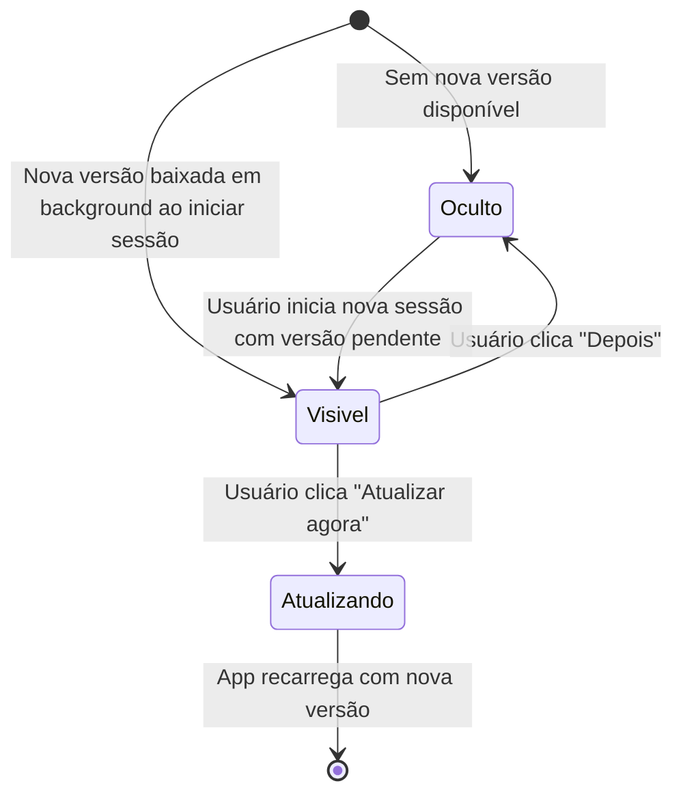

# Banner Atualização

## Visão Geral

| Campo | Valor |
|---|---|
| **Nome** | Banner Atualização |
| **Slug** | `banner-atualizacao` |
| **URL** | — (componente global, sem rota própria) |
| **Objetivo** | Notificar o usuário de que uma nova versão do app está disponível e oferecer a opção de atualizar imediatamente ou adiar para a próxima sessão. |

**Scenarios relacionados:**
- App detecta nova versão e exibe banner de atualização
- Usuário clica "Atualizar agora" e app recarrega
- Usuário clica "Depois" na atualização
- Banner de atualização reaparece na próxima sessão

---

## Componentes

### Botões

| Rótulo | Tipo | Comportamento |
|---|---|---|
| Atualizar agora | button | Recarrega o app imediatamente carregando a nova versão; usuário permanece autenticado após o reload |
| Depois | button | Fecha o banner; app continua na versão anterior; banner reaparece na próxima sessão |

### Conteúdo e mensagens fixas

- Notificação de que há uma atualização disponível do app

---

## Estados

### Padrão (initial)

Banner não exibido. O Service Worker monitora versão em background. A versão anterior continua totalmente funcional.

### Visível

Exibido ao iniciar uma nova sessão quando uma nova versão foi baixada em background. Apresenta os botões "Atualizar agora" e "Depois". A versão anterior continua funcional enquanto o banner é exibido.

### Atualizando

Usuário clicou em "Atualizar agora". O app faz reload imediato carregando a nova versão. A sessão autenticada do usuário é preservada após o reload. A interface passa a refletir a nova versão (ex: número de build atualizado).

### Oculto (após "Depois")

Usuário clicou em "Depois". O banner desaparece. O app continua respondendo normalmente com a versão anterior. Na próxima sessão, se a atualização ainda estiver disponível em cache, o banner reaparece.

---

## Considerações

### Validações

- O banner só é exibido quando uma nova versão foi baixada em background pelo Service Worker (REQ-7)
- O banner reaparece a cada nova sessão enquanto a atualização não for aplicada (REQ-12)
- O sistema nunca força reload durante sessão ativa — apenas após confirmação do usuário ou na próxima inicialização (REQ-15)
- Falha no download da atualização em background não exibe erro ao usuário (REQ-16)

### Acessibilidade

- Botões com rótulos explícitos ("Atualizar agora", "Depois") identificáveis por leitores de tela

### Responsividade

- Componente global exibido em mobile (Android e iOS), contexto principal de uso conforme PRD

---

## Referências Visuais

### Wireframe
_A preencher manualmente._

### Mockup
_A preencher manualmente._

### Protótipo interativo
_A preencher manualmente._
