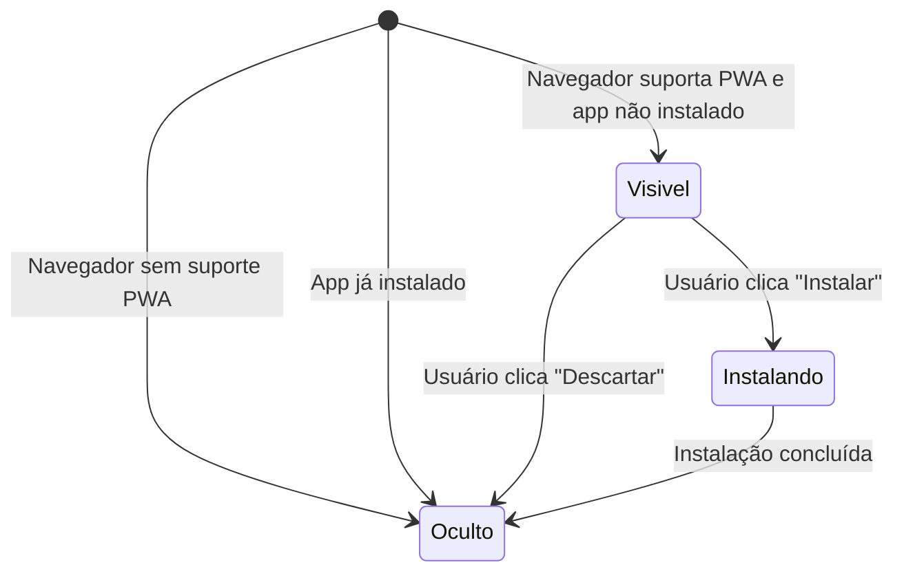

# Banner PWA

## Visão Geral

| Campo | Valor |
|---|---|
| **Nome** | Banner PWA |
| **Slug** | `banner-pwa` |
| **URL** | — (componente global, sem rota própria) |
| **Objetivo** | Permitir que o usuário instale o app como PWA no seu dispositivo a partir de um banner exibido sobre a interface principal. |

**Scenarios relacionados:**
- Usuário instala o app como PWA via banner
- Usuário descarta banner de instalação
- Navegador sem suporte PWA funciona como web app tradicional

---

## Componentes

### Botões

| Rótulo | Tipo | Comportamento |
|---|---|---|
| Instalar | button | Aciona o prompt nativo do navegador para instalação do app na tela inicial do dispositivo |
| Descartar | button | Fecha o banner e impede que ele reapareça na mesma sessão |

### Conteúdo e mensagens fixas

- Oferta visual de instalação do app como PWA

---

## Estados

### Padrão (initial)

Banner não exibido. O sistema aguarda o evento `beforeinstallprompt` do navegador para capturar o prompt de instalação. Quando o evento é recebido, o banner fica disponível para exibição.

### Visível

Exibido quando o navegador suporta instalação de PWA e o app ainda não está instalado no dispositivo. Apresenta os botões "Instalar" e "Descartar".

### Instalando

Usuário clicou em "Instalar". O sistema aciona o prompt nativo do navegador. O app é adicionado à tela inicial e abre em modo standalone sem barra de endereço.

### Oculto (após descartar)

Usuário clicou em "Descartar". O banner desaparece da tela e não reaparece na mesma sessão. O app continua funcionando normalmente como web app.

### Oculto (navegador sem suporte)

Quando o navegador não suporta instalação de PWA, o banner nunca é exibido. Nenhum erro técnico relacionado a PWA é exibido ao usuário.

---

## Considerações

### Validações

- O banner só é exibido se o evento `beforeinstallprompt` do navegador for disparado (REQ-1, REQ-22)
- O banner não é exibido se o app já estiver instalado no dispositivo (REQ-1)
- Após "Descartar", o banner não reaparece na mesma sessão (REQ-6)

### Acessibilidade

- Botões com rótulos explícitos ("Instalar", "Descartar") identificáveis por leitores de tela

### Responsividade

- Componente global exibido em mobile (Android e iOS), contexto principal de uso conforme PRD

---

## Referências Visuais

### Wireframe
_A preencher manualmente._

### Mockup
_A preencher manualmente._

### Protótipo interativo
_A preencher manualmente._
