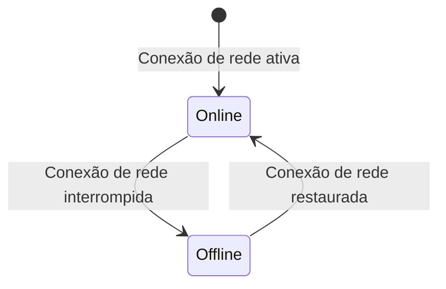

# Indicador Offline

## Visão Geral

| Campo | Valor |
|---|---|
| **Nome** | Indicador Offline |
| **Slug** | `indicador-offline` |
| **URL** | — (componente global presente na barra de navegação ou header, sem rota própria) |
| **Objetivo** | Sinalizar claramente ao usuário que o app está sem conexão de rede, e remover o indicador automaticamente quando a conexão for restaurada. |

**Scenarios relacionados:**
- App exibe indicador visual de modo offline
- App funciona offline com assets em cache

---

## Componentes

### Conteúdo e mensagens fixas

- `"Offline"` — rótulo exibido na barra de navegação ou header quando a conexão de rede é interrompida

---

## Estados

### Padrão (initial) — Online

Indicador não exibido. O app funciona normalmente com conexão de rede.

### Offline

Quando a conexão de rede é interrompida, o indicador visual "Offline" é exibido na barra de navegação ou header. O indicador sinaliza claramente que o app está sem conexão. A interface continua carregando e respondendo a partir do cache. O usuário pode visualizar dados locais sem erros técnicos.

### Retorno Online

Quando a conexão é restaurada, o indicador "Offline" desaparece automaticamente. Dados sincronizam automaticamente em background.

---

## Considerações

### Validações

- O indicador é exibido apenas quando a conexão de rede é interrompida (REQ-18)
- O indicador é removido automaticamente ao restaurar a conexão, sem ação do usuário (REQ-19)
- O app continua funcional offline com assets previamente cacheados (REQ-17)

### Acessibilidade

- Indicador com rótulo textual explícito ("Offline") legível por leitores de tela, sem depender apenas de cor ou ícone

### Responsividade

- Exibido na barra de navegação ou header — presente em todas as telas do app conforme cenário BDD

---

## Referências Visuais

### Wireframe
_A preencher manualmente._

### Mockup
_A preencher manualmente._

### Protótipo interativo
_A preencher manualmente._
